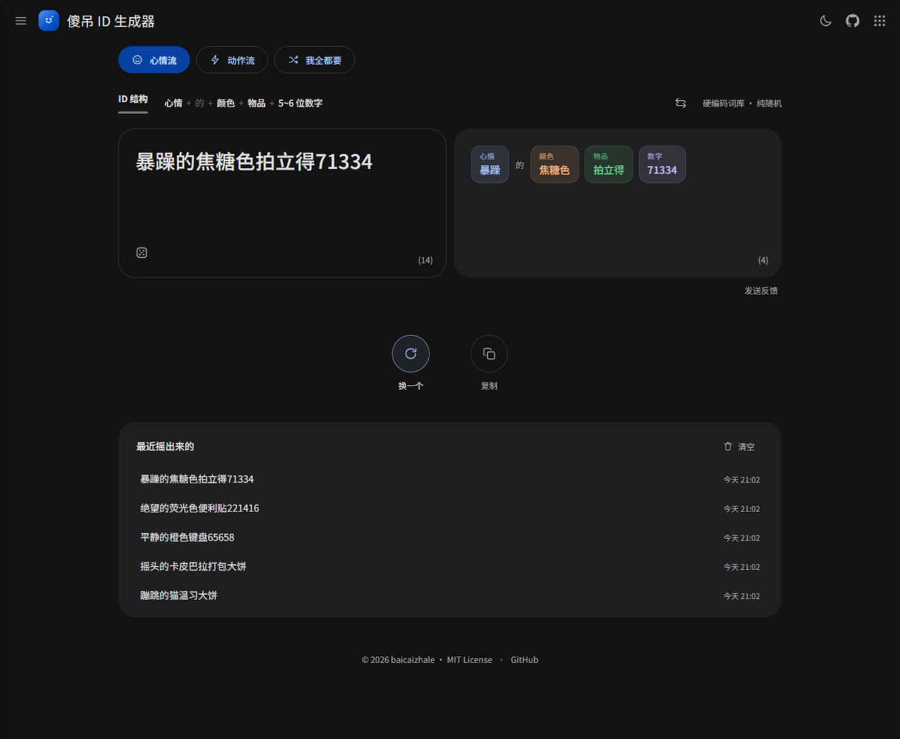
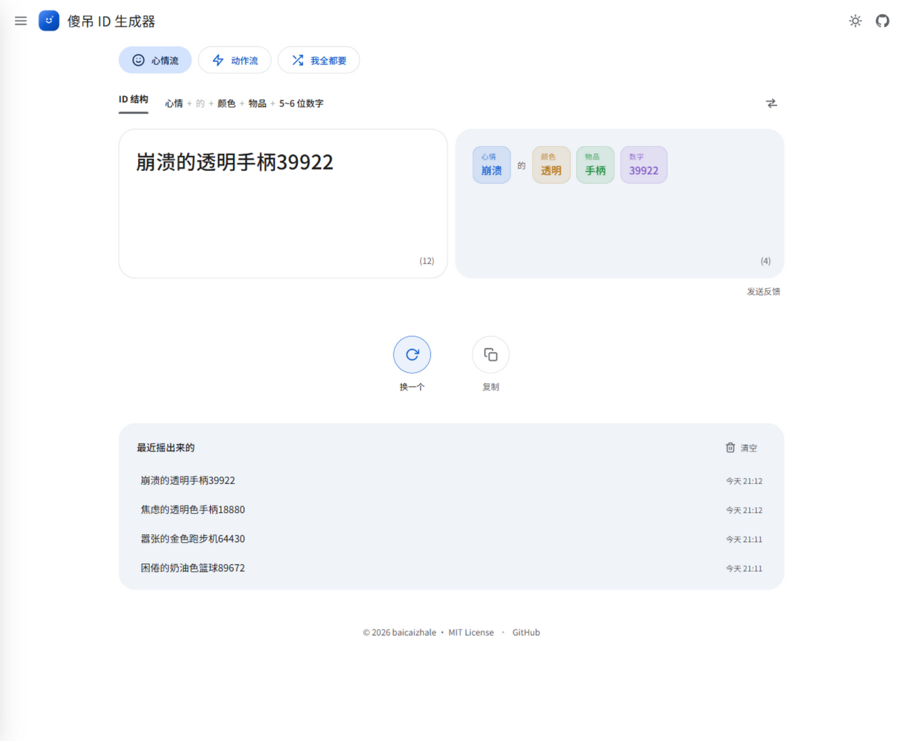

<div align="center">


# 傻吊 ID 生成器

点一下，摇一个不正经的 ID。

[](https://github.com/baicaizhale/Stupid-ID-Gen/stargazers)
[](https://github.com/baicaizhale/Stupid-ID-Gen/commits/main)
[](LICENSE)
[](https://ohmyid.baicaizhale.top)
[](https://workers.cloudflare.com/)

[在线体验](https://ohmyid.baicaizhale.top) ｜ [两种格式](#两种格式) ｜ [本地运行](#本地运行) ｜ [部署](#部署) ｜ [加词](CONTRIBUTING.md)


<br>


</div>

---

## 这是什么

一个随机起网名的网页。点一下出一条，比如：

> 迷茫的橙色拍立得942413
> 蛰伏的考拉将烤毛线

不满意就再点。词库 339 条全写在 `app.js` 里，生成过程就是 `Math.random()` 乱抽。没有后端，刷新即忘，历史记录只存在你自己的浏览器里。

## 两种格式

### 心情流

```
心情 + 的 + 颜色 + 物品 + 5~6 位数字
```

> 冷静的白键盘39023
> 冷静的白色键盘39023
> 精神内耗的彩虹色空气炸锅918347

颜色后面的「色」字随机出现，所以两种都会摇到。50 个心情、28 个颜色、74 个物品，数字是 5 位或 6 位、首位不为 0，合起来大约 2051 亿种组合。

### 动作流

```
不及物动作 + 的 + 名词 + 及物动词 + 名词
```

> 狂笑的蛇将写散文
> 静坐的水母炖泡面
> 摸鱼的卡皮巴拉点评红头文件

50 个动作、48 个名词、42 个动词、47 个宾语，大约 474 万种组合。「蛇将」本身是个名词，这一档没有连接词。

## 特性

- 三个格式按钮：心情流、动作流、我全都要（每次随机二选一）
- 点结果卡片、按 R 或空格，重新摇
- 复制按钮直接进剪贴板
- 历史记录保留最近 15 条，点一条复制一条
- 深色浅色两套主题，默认深色
- 手机上能用；除了 Google Fonts 没有别的第三方请求

## 本地运行

```bash
npx serve .
```

或者 `python -m http.server 5173`，或者直接双击 `index.html`。想改词就改 `app.js` 里的 `WORDS`，刷新生效。

## 项目结构

```
Stupid-ID-Gen/
├── index.html                  # 页面结构 + 内联 SVG 图标
├── style.css                   # 深浅两套主题变量 + 布局
├── app.js                      # 词库 WORDS、格式 FORMATS、生成逻辑
├── scripts/
│   └── build.mjs               # 把三个静态文件拷进 dist/
├── docs/                       # logo 与预览图
├── wrangler.toml               # Workers 配置：静态资源 + 自定义域名
├── .github/workflows/deploy.yml# push 到 main 自动部署
├── CONTRIBUTING.md             # 加词指南
└── LICENSE
```

## 部署

线上跑在 Cloudflare Workers 上，配置都在 `wrangler.toml`：`dist/` 是静态资源目录，`ohmyid.baicaizhale.top` 是自定义域名。wrangler 部署时会自动建 DNS 记录、签证书。

```bash
npm run deploy
```

首次部署需要先 `npx wrangler login`，或者在环境变量里配好 `CLOUDFLARE_API_TOKEN` 和 `CLOUDFLARE_ACCOUNT_ID`。

push 到 `main` 也会自动发布，走的是 `deploy.yml`：

1. 在 Cloudflare 后台用 Edit Cloudflare Workers 模板建一个 API Token；
2. `gh secret set CLOUDFLARE_API_TOKEN`（账号 ID 已经配好）；
3. 之后每次 push 自动上线。

没配 Token 时工作流会跳过部署，不会报错。

## 加词

词库越大，摇出来的越好笑。怎么加、词性怎么分，看 [CONTRIBUTING.md](CONTRIBUTING.md)。

## 设计说明

配色取自 Google 翻译深色模式的截图：背景 `#131314`，描边 `#444746`，选中胶囊 `#0842a0` 和 `#d3e3fd`，卡片 `#1e1f20`。字体 Noto Sans 和 Noto Sans SC，来自 Google Fonts。左上角的笑脸方块是手写的 SVG，单独放在 `docs/logo.svg`。拆解里每个片段一个颜色：心情蓝、颜色橙、物品绿、数字紫。

## License

[MIT](LICENSE) © 2026 [baicaizhale](https://github.com/baicaizhale)
